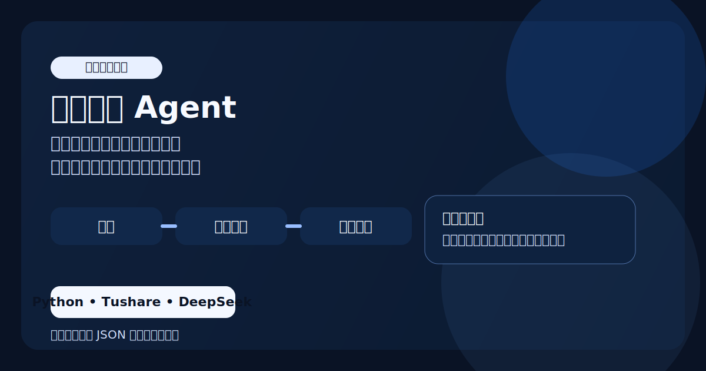
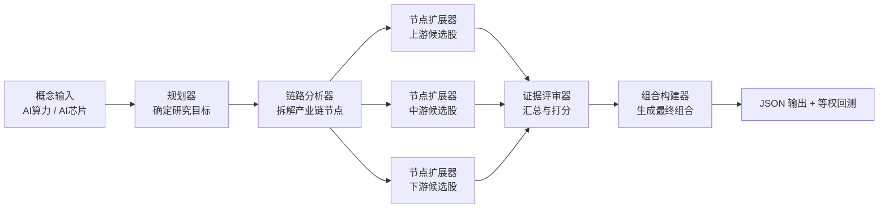

# 概念选股多智能体（Concept Stock Agent）



这是一个围绕“概念主题投资”设计的多智能体选股项目。它把概念输入、产业链拆解、候选股票扩展、证据评审和组合构建串成一条可本地运行、可复查的完整流程。

## 项目定位

给定一个概念主题，例如 `AI算力`、`AI芯片`，系统会：

- 自动匹配 Tushare 概念板块
- 将主题拆成产业链节点
- 并行扩展每个节点的候选股票
- 汇总证据并构建最终组合
- 对组合做简单等权回测

## 为什么这个项目值得展示

- 它不是单纯的 Prompt 演示，而是可跑通的完整流程
- 输出结果是结构化的，便于检查、复盘和继续迭代
- 它把卖方研究思路转成了本地研究工具
- 结构清晰，后续很容易扩展成更强的研究系统

## 架构图



## 流程说明

1. `planner` 把原始概念转成明确的研究任务。
2. `chain_analyzer` 将主题拆解成可投资的产业链节点。
3. `node_expander` 并行扩展每个节点的候选股票和理由。
4. `evidence_reviewer` 汇总证据、去重、过滤弱逻辑。
5. `portfolio_builder` 生成最终组合并进入回测环节。

## 技术栈

- `Python`
- `Tushare`：概念匹配、成分股、行情数据
- `DeepSeek`：多智能体推理
- 本地 JSON 工件：用于保存可复查结果

## 目录结构

```text
agents/      多智能体模块
data/        Tushare 与模型客户端
run.py       命令行入口
graph.py     流程编排
backtest.py  等权回测逻辑
config.py    模型与策略参数
```

## 安装

```bash
cd concept_stock_agent
python3 -m venv .venv
source .venv/bin/activate
pip install -r requirements.txt
```

## 环境变量

请在本地创建 `.env`：

```bash
TUSHARE_TOKEN=your_tushare_token
DEEPSEEK_API_KEY=your_deepseek_key
```

## 使用方式

```bash
# 基本用法：输入概念名，自动匹配 Tushare 概念板块
python run.py "AI算力"

# 手动指定 Tushare 概念代码
python run.py "AI算力" --concept-code TS0001

# 只跑选股流程，不做回测
python run.py "AI算力" --skip-backtest

# 自定义回测区间
python run.py "AI算力" --backtest-start 20250101 --backtest-end 20260414
```

## 输出结果

每次运行会在 `outputs/` 下生成一份 JSON，通常包含：

- 研究计划
- 产业链拆解结果
- 各节点股票推荐与理由
- 评审意见
- 最终组合

命令行界面会同时打印选出的股票以及回测摘要。

## 关键参数

主要参数位于 `config.py`：

- `CHAIN_MIN_NODES` / `CHAIN_MAX_NODES`：产业链节点数
- `STOCKS_PER_NODE_MIN` / `STOCKS_PER_NODE_MAX`：每个节点的候选股票数
- `PORTFOLIO_MAX_SIZE`：最终组合上限
- `BENCHMARK`：回测基准，默认 `000300.SH`
- `DEEPSEEK_MODEL`：推理模型，默认 `deepseek-chat`

## 模型切换

项目默认使用 DeepSeek，但模型层比较容易替换。

例如，你可以把 `config.py` 改成 Claude 兼容端点：

```python
DEEPSEEK_BASE_URL = "https://api.anthropic.com/v1"
DEEPSEEK_MODEL = "claude-sonnet-4-6"
```

然后在 `.env` 中换成对应的 Key 即可。

## 后续可扩展方向

- 引入更丰富的绩效评估指标
- 保存中间 Agent 推理轨迹
- 支持多个概念批量比较
- 接入更多数据源而不仅仅是 Tushare
